# puzzle-greatwall 时序图与流程图

长城案例为 3×3 拼图。场景默认选择 `phase0`。项目记录显示 Ego 复用了猫拼图积累的能力，长城结果为 9/12 条相邻关系、最大拼合组 8/9。第一组图按任务拆解模块调用，参考已有场景、工具与验收记录。第二组图比较感知配置。第三组图展示路线图设想。

- [实际任务的六个环节](#实际任务的六个环节)
- [四种感知配置](#四种感知配置)
- [Phase 2–5 路线图](#phase-25-路线图)

## 实际任务的六个环节

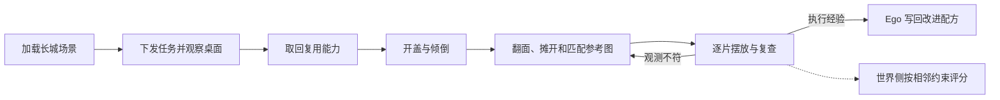
```mermaid
flowchart LR
    A["加载长城场景"] --> B["下发任务并观察桌面"]
    B --> C["取回复用能力"]
    C --> D["开盖与倾倒"]
    D --> E["翻面、摊开和匹配参考图"]
    E --> F["逐片摆放与复查"]
    F -->|观测不符| E
    F -->|执行经验| G["Ego 写回改进配方"]
    F -.-> H["世界侧按相邻约束评分"]
```

### 1. 场景启动与任务下发

长城场景声明 `phase0`，桌上是带完整参考图的盒盖，盒内 9 片。默认由宿主下发自然语言任务。

时序图

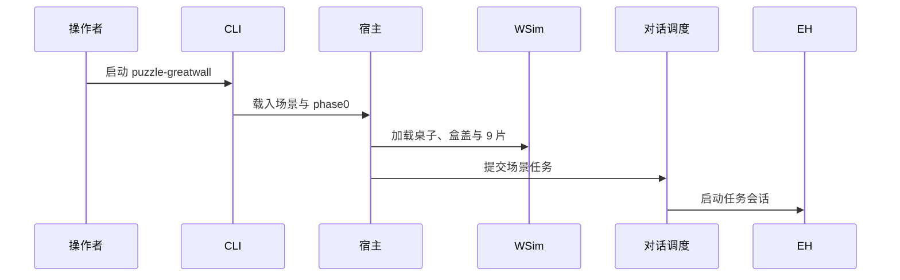
```mermaid
sequenceDiagram
    participant P0 as 操作者
    participant P1 as CLI
    participant P2 as 宿主
    participant P3 as WSim
    participant P4 as 对话调度
    participant P5 as EH
    P0->>P1: 启动 puzzle-greatwall
    P1->>P2: 载入场景与 phase0
    P2->>P3: 加载桌子、盒盖与 9 片
    P2->>P4: 提交场景任务
    P4->>P5: 启动任务会话
```

流程图

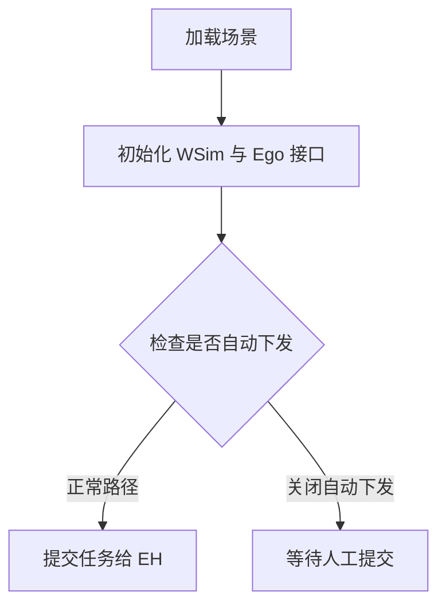
```mermaid
flowchart TD
    A["加载场景"]
    B["初始化 WSim 与 Ego 接口"]
    C{"检查是否自动下发"}
    D["提交任务给 EH"]
    A --> B
    B --> C
    C -->|正常路径| D
    C -->|关闭自动下发| X["等待人工提交"]
```

### 2. 观察桌面与查询能力

模型先列出并取回旧能力，再用自身观测定位参考图和盒子。

时序图

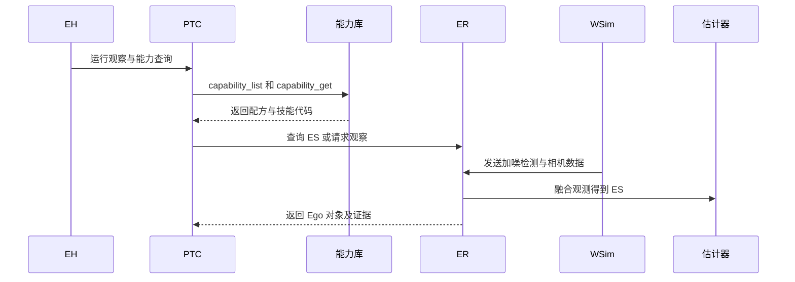
```mermaid
sequenceDiagram
    participant P0 as EH
    participant P1 as PTC
    participant P2 as 能力库
    participant P3 as ER
    participant P4 as WSim
    participant P5 as 估计器
    P0->>P1: 运行观察与能力查询
    P1->>P2: capability_list 和 capability_get
    P2-->>P1: 返回配方与技能代码
    P1->>P3: 查询 ES 或请求观察
    P4->>P3: 发送加噪检测与相机数据
    P3->>P5: 融合观测得到 ES
    P3-->>P1: 返回 Ego 对象及证据
```

流程图

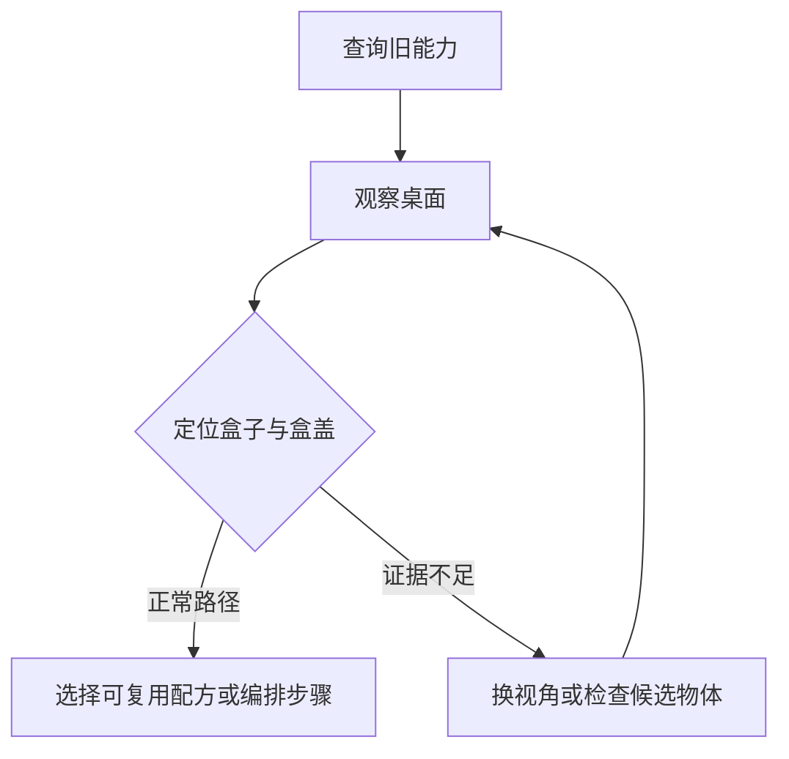
```mermaid
flowchart TD
    A["查询旧能力"]
    B["观察桌面"]
    C{"定位盒子与盒盖"}
    D["选择可复用配方或编排步骤"]
    A --> B
    B --> C
    C -->|正常路径| D
    C -->|证据不足| X["换视角或检查候选物体"]
    X --> B
```

### 3. 开盖与倾倒

开盖可拆成抓取盒盖并移开。`pour` 由运行时执行；动作预测和执行分离。下图展开通用动作回路，后续翻面和摆放也复用它。

时序图

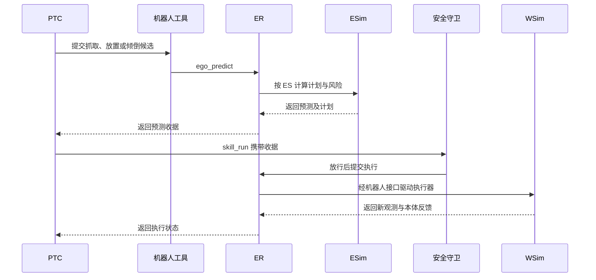
```mermaid
sequenceDiagram
    participant P0 as PTC
    participant P1 as 机器人工具
    participant P2 as ER
    participant P3 as ESim
    participant P4 as 安全守卫
    participant P5 as WSim
    P0->>P1: 提交抓取、放置或倾倒候选
    P1->>P2: ego_predict
    P2->>P3: 按 ES 计算计划与风险
    P3-->>P2: 返回预测及计划
    P2-->>P0: 返回预测收据
    P0->>P4: skill_run 携带收据
    P4->>P2: 放行后提交执行
    P2->>P5: 经机器人接口驱动执行器
    P5-->>P2: 返回新观测与本体反馈
    P2-->>P0: 返回执行状态
```

流程图

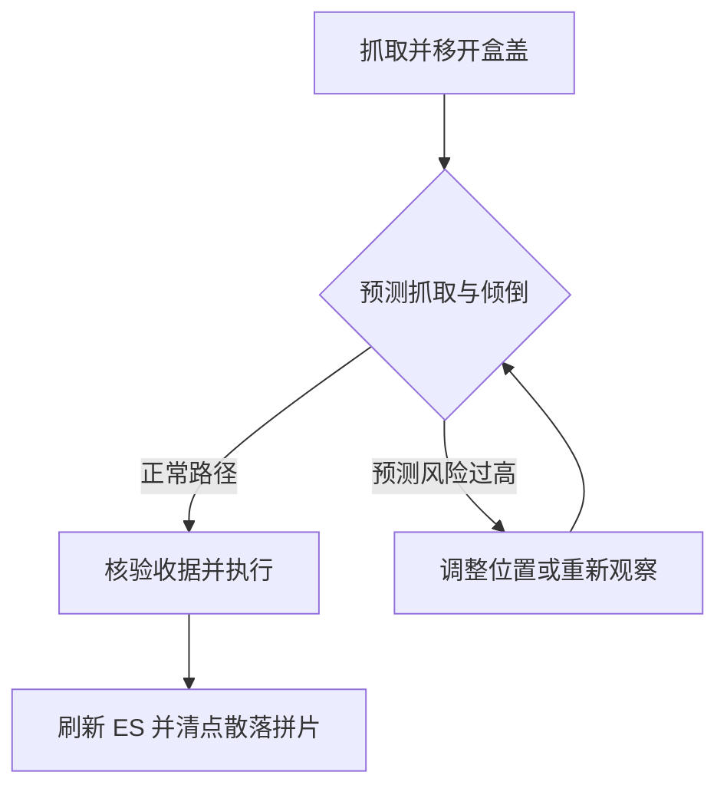
```mermaid
flowchart TD
    A["抓取并移开盒盖"]
    B{"预测抓取与倾倒"}
    C["核验收据并执行"]
    D["刷新 ES 并清点散落拼片"]
    A --> B
    B -->|正常路径| C
    C --> D
    B -->|预测风险过高| X["调整位置或重新观察"]
    X --> B
```

### 4. 翻面、摊开与图案匹配

本地记录显示复用 `flip_flat_objects_face_up`、`spread_flat_objects_in_row` 和 `match_faces_to_reference_grid`。以下展示这些能力与通用工具的职责，实际调用顺序可随观察调整。

时序图

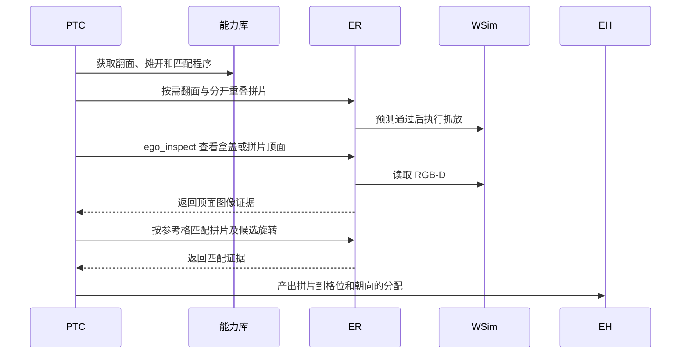
```mermaid
sequenceDiagram
    participant P0 as PTC
    participant P1 as 能力库
    participant P2 as ER
    participant P3 as WSim
    participant P4 as EH
    P0->>P1: 获取翻面、摊开和匹配程序
    P0->>P2: 按需翻面与分开重叠拼片
    P2->>P3: 预测通过后执行抓放
    P0->>P2: ego_inspect 查看盒盖或拼片顶面
    P2->>P3: 读取 RGB-D
    P2-->>P0: 返回顶面图像证据
    P0->>P2: 按参考格匹配拼片及候选旋转
    P2-->>P0: 返回匹配证据
    P0->>P4: 产出拼片到格位和朝向的分配
```

流程图

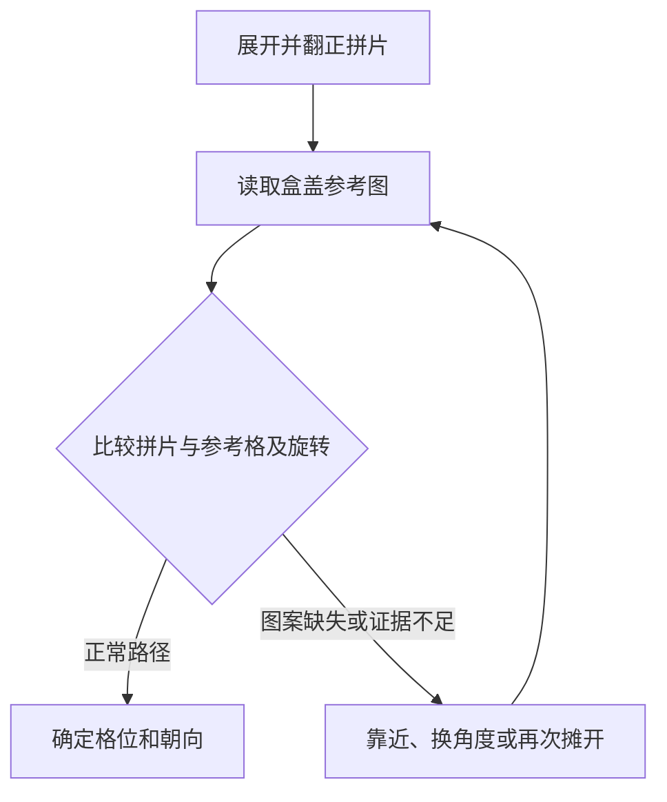
```mermaid
flowchart TD
    A["展开并翻正拼片"]
    B["读取盒盖参考图"]
    C{"比较拼片与参考格及旋转"}
    D["确定格位和朝向"]
    A --> B
    B --> C
    C -->|正常路径| D
    C -->|图案缺失或证据不足| X["靠近、换角度或再次摊开"]
    X --> B
```

### 5. 逐片摆放与失败恢复

`assemble_picture_from_reference` 负责组合工具。预测、执行和观察以 Ego 信息为依据。

时序图

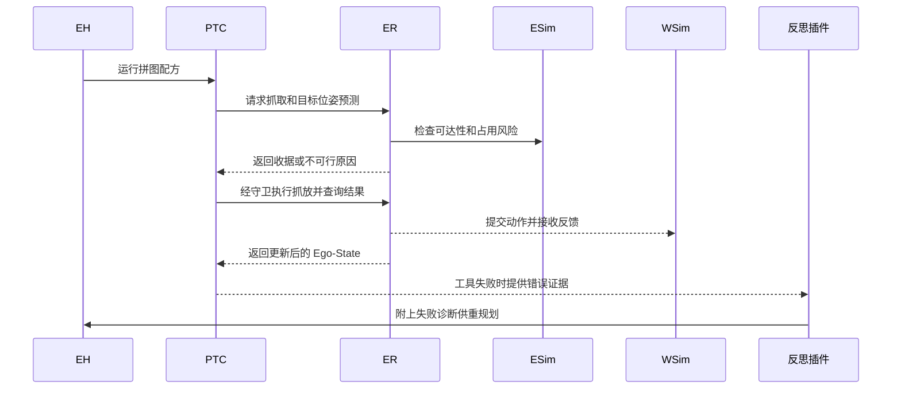
```mermaid
sequenceDiagram
    participant P0 as EH
    participant P1 as PTC
    participant P2 as ER
    participant P3 as ESim
    participant P4 as WSim
    participant P5 as 反思插件
    P0->>P1: 运行拼图配方
    P1->>P2: 请求抓取和目标位姿预测
    P2->>P3: 检查可达性和占用风险
    P2-->>P1: 返回收据或不可行原因
    P1->>P2: 经守卫执行抓放并查询结果
    P2-->>P4: 提交动作并接收反馈
    P2-->>P1: 返回更新后的 Ego-State
    P1-->>P5: 工具失败时提供错误证据
    P5->>P0: 附上失败诊断供重规划
```

流程图

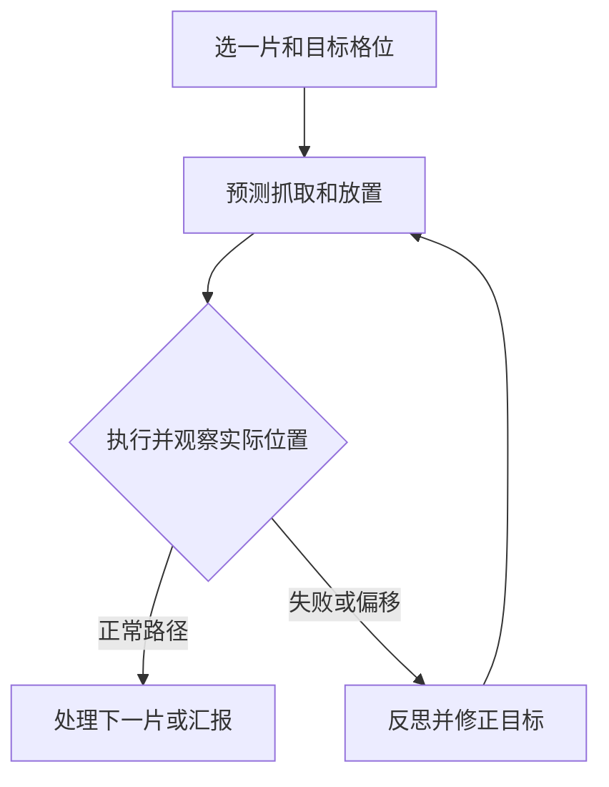
```mermaid
flowchart TD
    A["选一片和目标格位"]
    B["预测抓取和放置"]
    C{"执行并观察实际位置"}
    D["处理下一片或汇报"]
    A --> B
    B --> C
    C -->|正常路径| D
    C -->|失败或偏移| X["反思并修正目标"]
    X --> B
```

### 6. 世界侧验收与能力写回

记录为 9/12、最大拼合组 8/9。`complete` 根据最大连通组是否覆盖全部拼片判定。能力写回属于 Ego 路径，世界评分属于独立的评估路径。

时序图

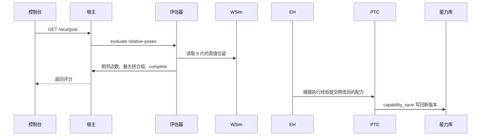
```mermaid
sequenceDiagram
    participant P0 as 控制台
    participant P1 as 宿主
    participant P2 as 评估器
    participant P3 as WSim
    participant P4 as EH
    participant P5 as PTC
    participant P6 as 能力库
    P0->>P1: GET /wca/goal
    P1->>P2: evaluate relative-poses
    P2->>P3: 读取 9 片的真值位姿
    P2->>P1: 相邻边数、最大拼合组、complete
    P1-->>P0: 返回评分
    P4->>P5: 根据执行经验提交修改后的配方
    P5->>P6: capability_save 写回新版本
```

流程图

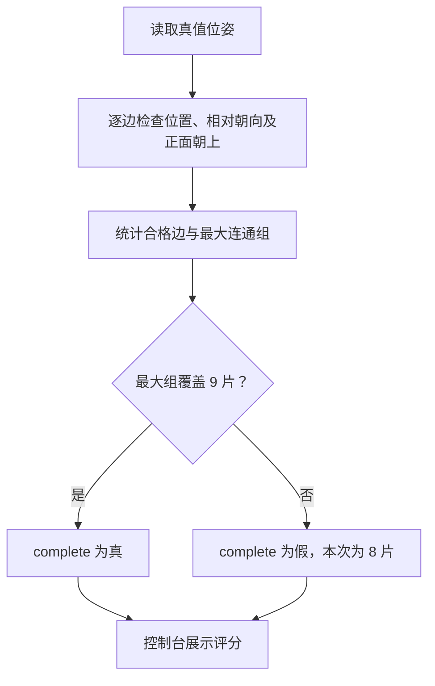
```mermaid
flowchart TD
    A["读取真值位姿"]
    B["逐边检查位置、相对朝向及正面朝上"]
    C["统计合格边与最大连通组"]
    D{"最大组覆盖 9 片？"}
    A --> B --> C --> D
    D -->|是| X["complete 为真"]
    D -->|否| Y["complete 为假，本次为 8 片"]
    X --> Z["控制台展示评分"]
    Y --> Z
```

## 四种感知配置

### 7. phase0 理想感知

长城案例实际配置。这里的理想指由仿真真值合成检测，仍有可见性判断和噪声。

时序图

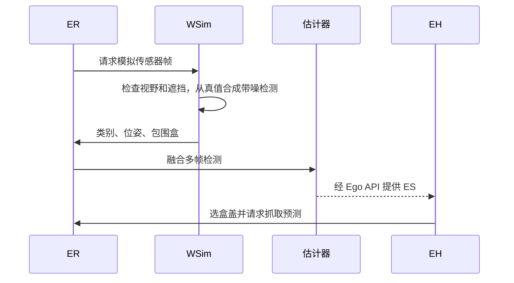
```mermaid
sequenceDiagram
    participant P0 as ER
    participant P1 as WSim
    participant P2 as 估计器
    participant P3 as EH
    P0->>P1: 请求模拟传感器帧
    P1->>P1: 检查视野和遮挡，从真值合成带噪检测
    P1->>P0: 类别、位姿、包围盒
    P0->>P2: 融合多帧检测
    P2-->>P3: 经 Ego API 提供 ES
    P3->>P0: 选盒盖并请求抓取预测
```

流程图

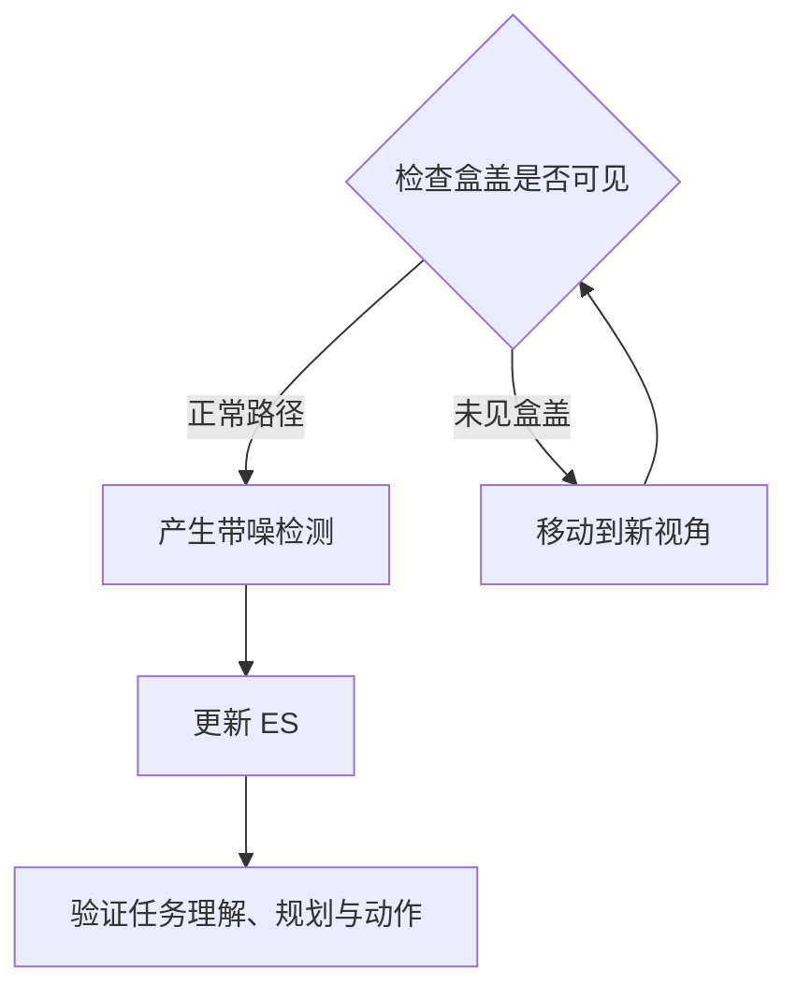
```mermaid
flowchart TD
    A{"检查盒盖是否可见"}
    B["产生带噪检测"]
    C["更新 ES"]
    D["验证任务理解、规划与动作"]
    A -->|正常路径| B
    B --> C
    C --> D
    A -->|未见盒盖| X["移动到新视角"]
    X --> A
```

### 8. phase0-misnamed 名称混淆

长城任务的对照设计。按名称混淆配置选择要干扰的类别，用来检查 Ego 能否找到实际指代的物体。

时序图

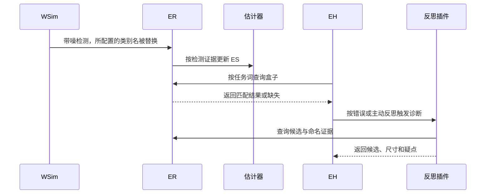
```mermaid
sequenceDiagram
    participant P0 as WSim
    participant P1 as ER
    participant P2 as 估计器
    participant P3 as EH
    participant P4 as 反思插件
    P0->>P1: 带噪检测，所配置的类别名被替换
    P1->>P2: 按检测证据更新 ES
    P3->>P1: 按任务词查询盒子
    P1-->>P3: 返回匹配结果或缺失
    P3->>P4: 按错误或主动反思触发诊断
    P4->>P1: 查询候选与命名证据
    P4-->>P3: 返回候选、尺寸和疑点
```

流程图

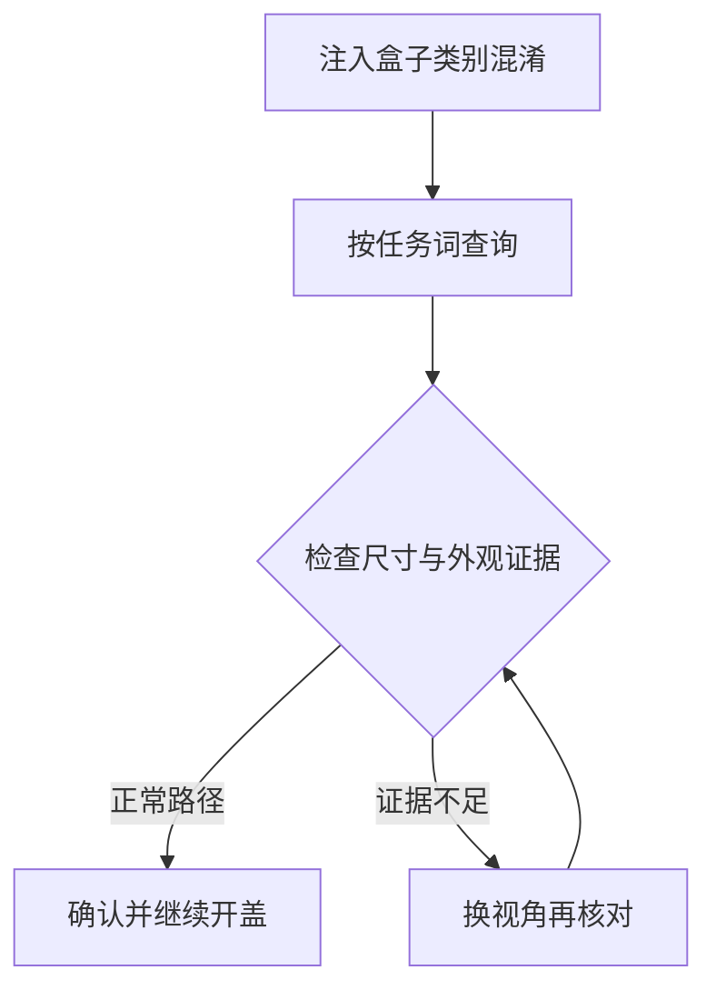
```mermaid
flowchart TD
    A["注入盒子类别混淆"]
    B["按任务词查询"]
    C{"检查尺寸与外观证据"}
    D["确认并继续开盖"]
    A --> B
    B --> C
    C -->|正常路径| D
    C -->|证据不足| X["换视角再核对"]
    X --> C
```

### 9. phase1 RGB-D 与仿真掩码

长城任务的对照设计，用于隔离三维重建、分类与跟踪问题。

时序图

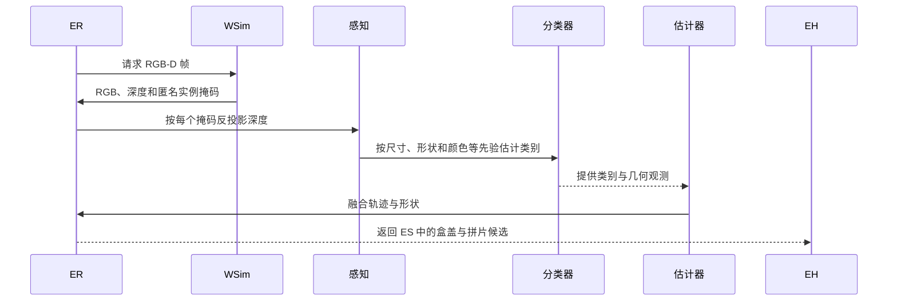
```mermaid
sequenceDiagram
    participant P0 as ER
    participant P1 as WSim
    participant P2 as 感知
    participant P3 as 分类器
    participant P4 as 估计器
    participant P5 as EH
    P0->>P1: 请求 RGB-D 帧
    P1->>P0: RGB、深度和匿名实例掩码
    P0->>P2: 按每个掩码反投影深度
    P2->>P3: 按尺寸、形状和颜色等先验估计类别
    P3-->>P4: 提供类别与几何观测
    P4->>P0: 融合轨迹与形状
    P0-->>P5: 返回 ES 中的盒盖与拼片候选
```

流程图

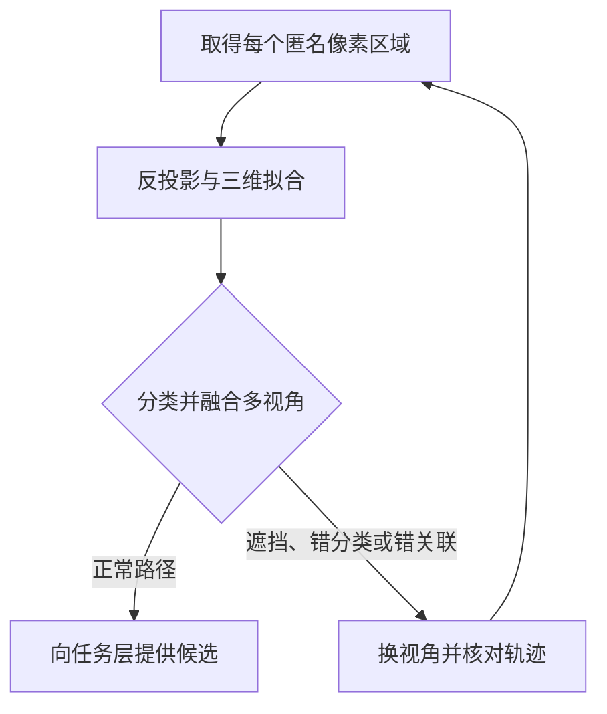
```mermaid
flowchart TD
    A["取得每个匿名像素区域"]
    B["反投影与三维拟合"]
    C{"分类并融合多视角"}
    D["向任务层提供候选"]
    A --> B
    B --> C
    C -->|正常路径| D
    C -->|遮挡、错分类或错关联| X["换视角并核对轨迹"]
    X --> A
```

### 10. phase1-sam RGB-D 与 SAM 3.1

长城任务的对照设计，用于检查完整感知链路，尤其是拥挤桌面上的漏检、分割粘连与语义混淆。

时序图

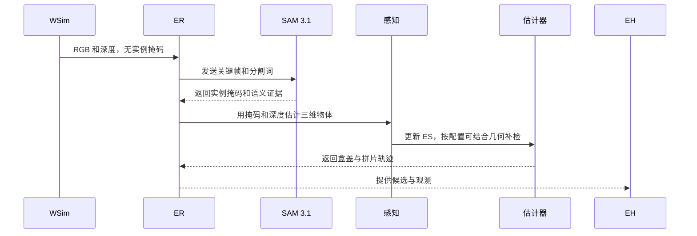
```mermaid
sequenceDiagram
    participant P0 as WSim
    participant P1 as ER
    participant P2 as SAM 3.1
    participant P3 as 感知
    participant P4 as 估计器
    participant P5 as EH
    P0->>P1: RGB 和深度，无实例掩码
    P1->>P2: 发送关键帧和分割词
    P2-->>P1: 返回实例掩码和语义证据
    P1->>P3: 用掩码和深度估计三维物体
    P3->>P4: 更新 ES，按配置可结合几何补检
    P4-->>P1: 返回盒盖与拼片轨迹
    P1-->>P5: 提供候选与观测
```

流程图

```mermaid
flowchart TD
    A["获取整张 RGB-D 图"]
    B{"SAM 分割与语义识别"}
    C["三维估计并更新 ES"]
    D["检查拼片覆盖后继续"]
    A --> B
    B -->|正常路径| C
    C --> D
    B -->|漏检或把多片粘成一块| X["换视角或按配置做几何补检"]
    X --> A
```

## Phase 2–5 路线图

### 11. Phase 2 物理推演与扰动

路线图设想。以倾倒可能让拼片滑到桌外为例。

时序图

```mermaid
sequenceDiagram
    participant P0 as WH
    participant P1 as WSim
    participant P2 as ER
    participant P3 as EH
    participant P4 as ESim
    participant P5 as 观察器
    P0->>P1: 通过 WCA 设置受控扰动
    P1->>P2: 通过传感器呈现变化
    P3->>P2: 提交多个倾倒姿态
    P2->>P4: 用 ES 的不确定度采样比较物理后果
    P4-->>P3: 经 ER 返回滑落风险
    P3->>P2: 选择合适姿态并重新观察
    P1-->>P5: 提供独立结果用于比较
```

流程图

```mermaid
flowchart TD
    A["设置扰动并观测"]
    B["对候选倾倒动作做物理推演"]
    C{"选择低风险动作"}
    D["观察执行结果并评估"]
    A --> B
    B --> C
    C -->|正常路径| D
    C -->|风险过高| X["改倾倒角度或桌面位置"]
    X --> B
```

### 12. Phase 3 精细操作与长时任务

路线图设想。以最后一片与邻片间隙很小为例。

时序图

```mermaid
sequenceDiagram
    participant P0 as EH
    participant P1 as ER
    participant P2 as 精细技能
    participant P3 as 控制器
    participant P4 as WSim
    P0->>P1: 选择剩余格位并下发精细放置
    P1->>P2: 传入目标位姿与局部观测
    P2-->>P3: 按反馈调整腕姿与夹爪
    P3->>P4: 执行微调
    P4-->>P1: 返回图像和本体反馈
    P1->>P0: 报告对齐或偏差
```

流程图

```mermaid
flowchart TD
    A["选定剩余拼片"]
    B["闭环调节姿态和落点"]
    C{"检查拼片是否对齐"}
    D["继续余下步骤"]
    A --> B
    B --> C
    C -->|正常路径| D
    C -->|仍有偏差| X["重新估计并微调"]
    X --> B
```

### 13. Phase 4 多机器人协作

路线图设想。两台机器人分工处理拼片，各自依靠自己的观测。

时序图

```mermaid
sequenceDiagram
    participant P0 as Ego A
    participant P1 as Ego B
    participant P2 as 共享桌面
    P0->>P1: 协商摊片区与拼图区
    P0->>P2: 翻正并摊开拼片
    P0->>P1: 通知可取位置
    P2->>P1: 经自身相机观察交接区
    P1->>P0: 确认接手并报告进度
    P1->>P2: 按参考格摆放
```

流程图

```mermaid
flowchart TD
    A["约定分工与交接区"]
    B["A 摊开并发交接消息"]
    C{"B 自己观察并确认"}
    D["B 拼合并反馈进度"]
    A --> B
    B --> C
    C -->|正常路径| D
    C -->|未确认交接或工作区冲突| X["暂停并重新协调"]
    X --> A
```

### 14. Phase 5 实体机器人

路线图设想。同一任务交由真实机器人，验证相机与夹爪标定、接触控制和实际拼合。

时序图

```mermaid
sequenceDiagram
    participant P0 as 真实桌面
    participant P1 as 相机与编码器
    participant P2 as Real HAL
    participant P3 as ER
    participant P4 as EH
    participant P5 as 夹爪与底盘
    participant P6 as 外部测量
    participant P7 as 评估
    P0-->>P1: 提供真实观测
    P1->>P2: 读取图像与本体状态
    P2->>P3: 传入观测
    P3-->>P4: 提供 ES 与执行反馈
    P4->>P3: 编排开盖、倾倒和拼合
    P3->>P2: 下发经本地监督的技能动作
    P2->>P5: 执行动作
    P6->>P7: 核对实机拼合
```

流程图

```mermaid
flowchart TD
    A["标定相机与夹爪"]
    B["从实机观测建立 ES"]
    C{"执行并观察实际拼合"}
    D["用外部测量核对结果"]
    A --> B
    B --> C
    C -->|正常路径| D
    C -->|打滑、遮挡或偏差| X["安全停止或重新观察与调整"]
    X --> B
```

## 实现依据

- [场景生成与相邻约束](../../steward/src/steward/authoring/service.py#L470)
- [宿主自动下发任务](../../steward/src/steward/world/server.py#L284)
- [感知模式](../../steward/src/steward/phases.py#L14)
- [Ego Runtime 与传感器模式](../../steward/src/steward/ego/runtime.py#L351)
- [Ego API](../../steward/src/steward/ego/server.py)
- [能力库](../../steward/dsh/packages/dsh-tool-ego-capabilities/src/index.ts)
- [相邻关系验收](../../steward/src/steward/world/goals.py)
- [项目路线图与长城案例记录](../../steward.md#13-implementation-progress)
